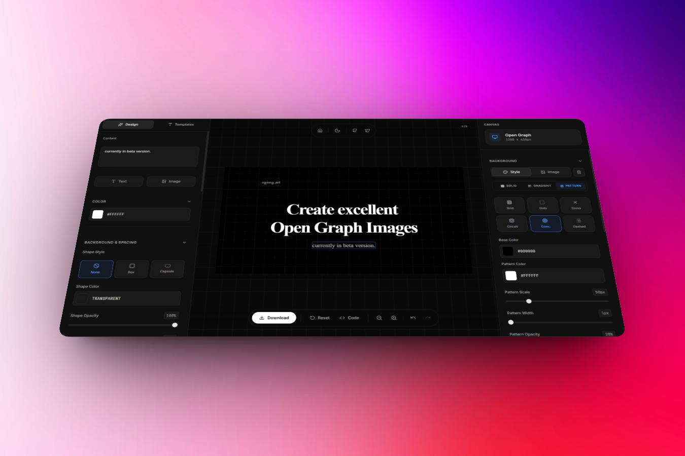
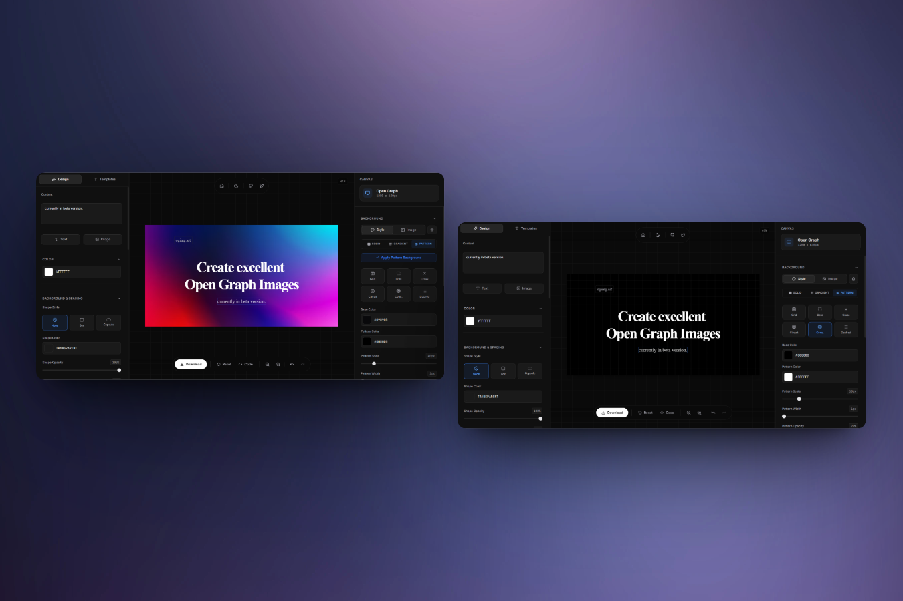
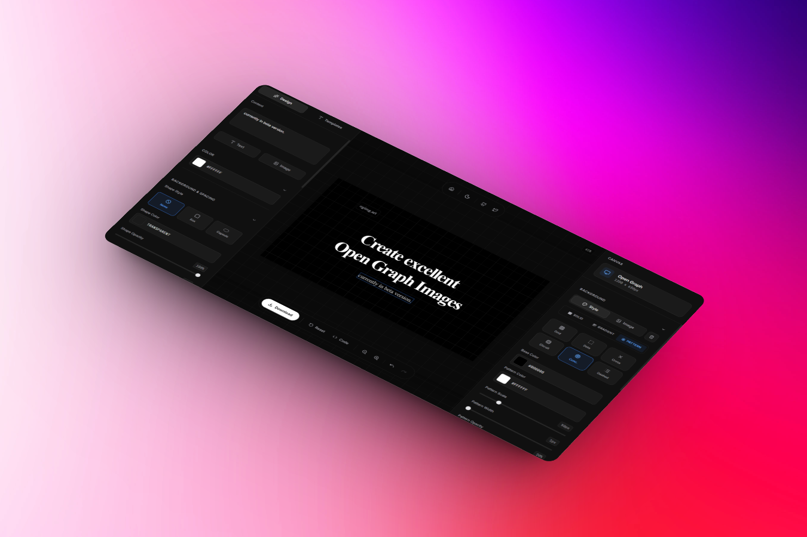
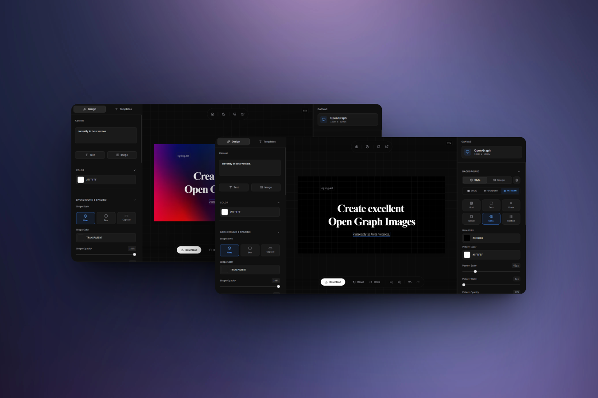
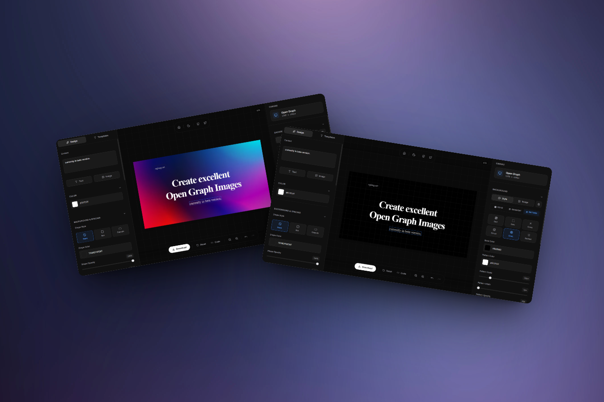

<!-- # ogimg -->

> _**The OG image generator for everyone. shipped fast.**_

<div align="center">
  
  <br /><br />
  <p align="left">
    <strong>Create stunning Open Graph (OG) images for your website.</strong>
    A free, open-source, modern OG image generator built with Next.js — made to help you design brand-consistent link previews that look great everywhere.
    <br /><br />
    <em>Ideal for Next.js/React apps (and any site that needs better social sharing).</em>
  </p>
  <br />
  <p align="center">
    
    
    
  </p>
</div>

---

## Visit: **[ogimg.art](https://ogimg.art)**








> _**Status:** Landing page is live. The editor route (`/editor`) is linked in the UI, but not implemented yet (cooking)._

## Features

- **Clean, modern landing** - polished UI with dark mode
- **Developer-centric stack** - Next.js App Router + TypeScript + Tailwind CSS
- **Design system ready** - Radix UI + shadcn/ui components

## Tech Stack

- **Next.js 16** (App Router) + **React 19**
- **TypeScript**
- **Tailwind CSS v4**
- **Radix UI** + **shadcn/ui**
- **next-themes** (theme switching) + theme switch animation
- **motion** (UI animations)
- **Biome** (lint/format)

## Getting Started

### Prerequisites

- Node.js **18+** (recommended **20+**)
- pnpm / npm / yarn / bun

### Installation

```bash
git clone https://github.com/ogimg/ogimg.git
cd ogimg
pnpm install
# or
npm install
```

### Run locally

```bash
pnpm dev
# or
npm run dev
```

Then open `http://localhost:3000`.

## Scripts

```bash
# dev server
pnpm dev
# or
npm run dev

# production build + start
pnpm build
pnpm start
# or
npm run build
npm run start

# lint/format (Biome)
pnpm lint
pnpm lint:fix
pnpm format
# or
npm run lint
npm run lint:fix
npm run format
```

## How to Use

1. Open **[ogimg.art](https://ogimg.art)**.
2. Click **Start Designing** to open the editor (coming soon).
3. Choose a template, add your title/branding, and tweak colors/fonts.
4. Export the result as a PNG and use it as your Open Graph image.

## Project Structure

```
ogimg/
├── app/                # Next.js routes, layout, global styles
├── components/         # UI + landing components
├── constants/          # site URLs, social links, feature list
├── lib/                # shared utilities and font config
├── public/             # static assets (logo, screenshots, etc.)
└── app/metadata.ts     # SEO/OpenGraph/Twitter metadata
```

## Deployment

This is a standard Next.js app and deploys cleanly on Vercel.

- Build: `pnpm build` (or `npm run build`)
- Start: `pnpm start` (or `npm run start`)

## Contributing

- Open an issue or PR on `https://github.com/ogimg/ogimg`
- Please read `CONTRIBUTING.md` and follow `CODE_OF_CONDUCT.md`
- Please run `pnpm lint` (or `npm run lint`) before submitting changes

## License

Licensed under the **Apache License 2.0**. See `LICENSE`.

## Support

For questions, issues, or suggestions:

- Open an issue on GitHub
- Check existing issues before creating new ones
- Provide detailed information for bug reports


## Built By

- Twitter(X): [@meghtrix](https://x.com/meghtrix)
- Alternate Twitter(X): [@ogimg_art](https://x.com/ogimg_art)
- GitHub: [@megh-bari](https://github.com/megh-bari)

If you like this project, consider giving it a ⭐️ on GitHub and sharing it with others!

## Star History

<a href="https://www.star-history.com/#ogimg/ogimg&type=date&legend=top-left">
 <picture>
   <source media="(prefers-color-scheme: dark)" srcset="https://api.star-history.com/svg?repos=ogimg/ogimg&type=date&theme=dark&legend=top-left" />
   <source media="(prefers-color-scheme: light)" srcset="https://api.star-history.com/svg?repos=ogimg/ogimg&type=date&legend=top-left" />
   
 </picture>
</a>


> _**Happy coding!**_